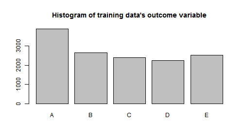
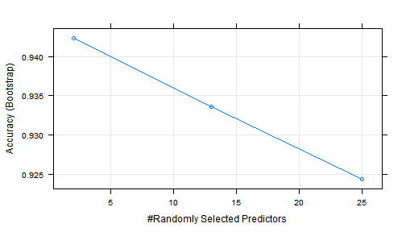

## Machine Learning helps to identify patterns in your Weight Lifting Exercises

In this report machine learning is used to ananlyse the data of the weight lifting excercise, quantify the movement, and identify patterns which can be used to correct and improve your weight lifting skills. 

Specifically, we will analyse the data measured by accelerometers on the belt, forearm, arm, and dumbell of six participants.They were asked to perform barbell lifts correctly and incorrectly in 5 different ways. The goal is to identify these find different patterns besed on the data from accelerometer using machine learning techniques, and to provide predictive model to classify new data. 20 New test samples will be used to validate the model. 


The datasets used in the analysis can be found as follows:
- Training dataset: https://d396qusza40orc.cloudfront.net/predmachlearn/pml-training.csv
- Testing dataset: https://d396qusza40orc.cloudfront.net/predmachlearn/pml-testing.csv

### 1. Preprocess the data
First we load in the training and testing datasets, 


```r
raw_data <- read.csv("pml-training.csv")
raw_Model_test <- read.csv("pml-testing.csv")
```

Both training and testing dataset has 160 variables, many of which have missing values. So the first step is to identify those columns with missing values using the testing dataset (raw_Model_test), and remove them in both datasets:


```r
tmp<-!apply(is.na(raw_Model_test), 2, all)
new_data<-raw_data[,tmp]
new_Model_test<-raw_Model_test[,tmp]
```

Now the datasets have 60 variables left. Next we need to further reduce the number of variables. One way to do it is to use principal component ananlysis (PCA). PCA requires all the variables be numeric, so we remove all non-numeric variables, and only include the data related to belt,forarm, dumbell, arm, and the outcome variable "classe" (for testing data, the variable of problem-id is included), 


```r
tmp<-names(new_data)[grep("belt|forearm|arm|dumbell|classe",names(new_data))]
new_data<-new_data[,tmp]
tmp<-names(new_Model_test)[grep("belt|forearm|arm|dumbell|problem",names(new_Model_test))]
new_Model_test<-new_Model_test[,tmp]
```

Now the total number of features are 39 plus the outcome "classe". Next we split the new training dataset (new_data) into a training dataset (Training, 70%) and a Testing dataset (Testing, 30%). This testing dataset will be used to cross-validate the model.


```r
library(caret)
```

```
## Loading required package: lattice
## Loading required package: ggplot2
```

```r
set.seed(0)
Intrain <- createDataPartition(y = new_data$classe, p=0.7,list=FALSE)
Training <- new_data[Intrain,]
Testing  <- new_data[-Intrain,]
```
A histgram of Training dataset is plotted to see whether the samples are relatively uniformly distrinuted:

```r
plot(Training$classe,breaks=20)
```

```
## Warning: "breaks" is not a graphical parameter
## Warning: "breaks" is not a graphical parameter
## Warning: "breaks" is not a graphical parameter
## Warning: "breaks" is not a graphical parameter
```

```r
title("Histogram of training data's outcome variable")
```

 
The distribution looks ok.

Now we are ready to perform principal component analysis as follows:

```r
# leave out #40 column: classe as the outcome variable
preP <- preProcess(Training[,-40], method = "pca", thresh = 0.98)
```

After preprocessing, one last preprocessing step is the apply 'predict' function is to both the training and testing subsets:

```r
trainP <- predict(preP,Training[,-40])
testP<-predict(preP,Testing[,-40])
```

### 2.Training the model

The model we pick is a "random forest". The transformed training dataset trainP is used as the training pridictors, and the Training$classe is the outcome variable:


```r
library(randomForest)
# modelF1 <- train(Training$classe ~ .,method="rf",data=trainP)
load("modelF1.RData") #load saved model because it takes over 1 hour to train.
```

After training, we plot the accuracy of the trained model(modelF1)

```r
plot(modelF1)
```

 

### 3.Validate the model

To cross-validate the model, we applied the model to our testing dataset (Testing) :

```r
testResult<-predict(modelF1,testP)
```

and compare the pridicted values with the real values:

```r
confusionMatrix(Testing$classe,testResult)
```

```
## Confusion Matrix and Statistics
## 
##           Reference
## Prediction    A    B    C    D    E
##          A 1643   20    8    2    1
##          B   31 1084   12    7    5
##          C   13   22  957   26    8
##          D    8    0   49  906    1
##          E    0    5    6    8 1063
## 
## Overall Statistics
##                                         
##                Accuracy : 0.961         
##                  95% CI : (0.955, 0.965)
##     No Information Rate : 0.288         
##     P-Value [Acc > NIR] : < 2e-16       
##                                         
##                   Kappa : 0.95          
##  Mcnemar's Test P-Value : 0.000612      
## 
## Statistics by Class:
## 
##                      Class: A Class: B Class: C Class: D Class: E
## Sensitivity             0.969    0.958    0.927    0.955    0.986
## Specificity             0.993    0.988    0.986    0.988    0.996
## Pos Pred Value          0.981    0.952    0.933    0.940    0.982
## Neg Pred Value          0.988    0.990    0.985    0.991    0.997
## Prevalence              0.288    0.192    0.175    0.161    0.183
## Detection Rate          0.279    0.184    0.163    0.154    0.181
## Detection Prevalence    0.284    0.194    0.174    0.164    0.184
## Balanced Accuracy       0.981    0.973    0.957    0.971    0.991
```

The accuracy is 0.961. The expected out of sample error is less  than 5%.

### 4.Results

Now we are ready to apply our model to the model test dataset to predict the outcomes: 


```r
testModel<-predict(preP,new_Model_test[,-40])
finalTest<-predict(modelF1,testModel)
finalTest
```

```
##  [1] B A A A A E D B A A B C B A E E A B B B
## Levels: A B C D E
```
Only Number 3 is not right, 1 out of 20 test cases, or about 95% accuracy, is consistant with the cross-validate results. 
